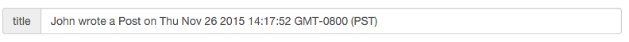
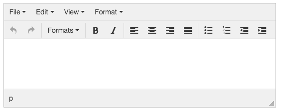
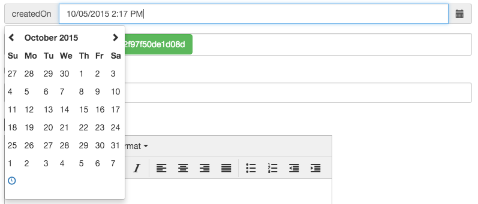
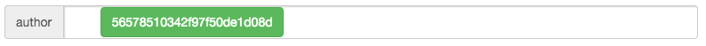

# Sriracha
A super spicy admin backend for Express and Mongoose.


  [](https://travis-ci.org/hdngr/sriracha)
  [](https://coveralls.io/github/hdngr/sriracha?branch=master)
  [](https://david-dm.org/hdngr/sriracha)
  [](https://david-dm.org/hdngr/sriracha#info=devDependencies)
  [](https://badge.fury.io/js/sriracha-admin)

Sriracha is an Express app that can be mounted as middleware to any url in your application.  The admin site's routes and editing interface are generated dynamically based on your Mongoose Models.  Options are available to control the look and feel of the admin site.

## Quick Start
1. Install Sriracha:

  ```
  npm install --save sriracha-admin
  ```

2. Include Sriracha in your express app and mount it to a url.

  ```
  var express = require('express');
  var admin = require('sriracha-admin');

  app = express();
  ...
  app.use('/admin', admin());
  ```

3. Login with username `admin` and password `admin`.

  Sriracha is running at `yourapp/admin`!


## Setting Options Globally
Options can be set globally through the options object passed to the middleware.
  
  ```
  var options = {...};
  app.use('/admin', admin(options));
  ```

**username**<br> 
*default*: `'admin'` User name used to access admin backend. 

**password**<br>
*default*: `'admin'` Password used to access the admin backend.

**hideFields**:<br>
*default*: `['_id', '_v']` Fields that are hidden in all documents and collections.

**\<collection\>.searchField**:<br>
*default*: `undefined` Sriracha implements a simple (for now) autocomplete query against the specified field.

For instance, to search against the *email* field in the *User* model, you would supply the following option:

```
var options = {
...,
User: {
  searchField: 'email'
}
...
}
```

**\<collection\>.admin**<br>
*default*: `undefined` A setting of false will hide this field from the admin.

## Field Types
Field types are set automatically by Sriracha based on the Mongo schema type.  However, they can also be customized.  Using the 'adminFieldType' option.  See the [setting options on a schema](#setting-options-on-a-schema) for examples of how to set custom field types. 

 Sriracha currently supports the following field types:

 **text**<br>
*default*: String and ObjectId schema types. 
A simple string input field.



**textarea**<br>
*default*: none 
The text area field allows easy inline editing of larger portions of text.  The textarea field uses [TinyMCE](https://www.tinymce.com/) and stores it's results as HTML.



**date**<br>
*default*: Date schema type. 
A date picker field using the [datepicker jquery plugin](https://eonasdan.github.io/bootstrap-datetimepicker).



**array**<br>
*default*: Array schema type. 
An input that accepts a comma separated list of values.


**checkbox**<br>
*default*: Boolean schema type. 
A checkbox that setts a boolean field to `true` or `false.`

**ref**<br>
*default*: Reference to other documents. 
An input of tags representing references to other documents.



## Setting Options on a Schema
All `<collection>` level options can be set on an individual schema as well. They will take precedence over the same options if they are also defined globally.  

To set schema level options, provide the option, prefixed with `admin`.

For example, the following schema would set the `lastName` to the search field for users, and would hide the `email` and `onboarding.signupDate` fields.
    
  ```
  ...
  var Schema = mongoose.Schema;

  var UserSchema = new Schema({
    lastName: {
      type: String,
      default: '',
      adminSearchField: true
    },
    ...,
    email: {
      type: String,
      admin: false
    }
    onboarding: {
      signupDate: {
        type: Date,
        admin: false
      },
      hasLoggedIn: {
        type: Boolean,
        default: false
      }
    },
  });
  ...
  ```


## Examples
Examples can be found in the `./examples` directory.  To run them:

```
git clone <this-repo-or-your-fork>
cd <this-repo-or-your-fork>
npm install
# run the app with simple setup
gulp simple
# run the app with advanced setup
gulp advanced
```

## Contributing
Contributing is anything from filing bugs, to requesting new features, to building features and their tests.  Read the [Contributing](./Contributing.md) doc to find out more.

## Acknowledgments
Thanks [Iron Summit Media Strategies](http://www.ironsummitmedia.com/) for the awesome [Start Bootstrap Themes](http://startbootstrap.com/).

Siracha started with [SB Admin](http://startbootstrap.com/template-overviews/sb-admin/) and I used [Jade Converter](http://html2jade.org/) to turn it into Jade.
